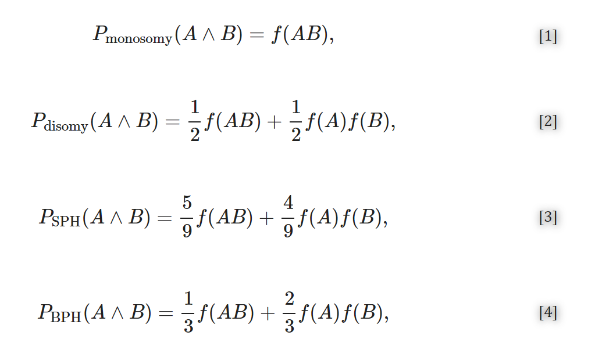
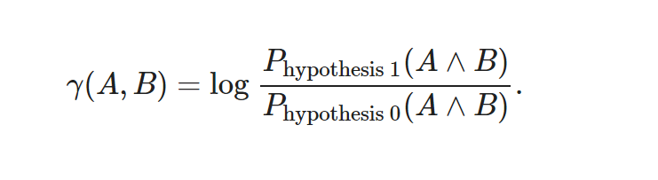
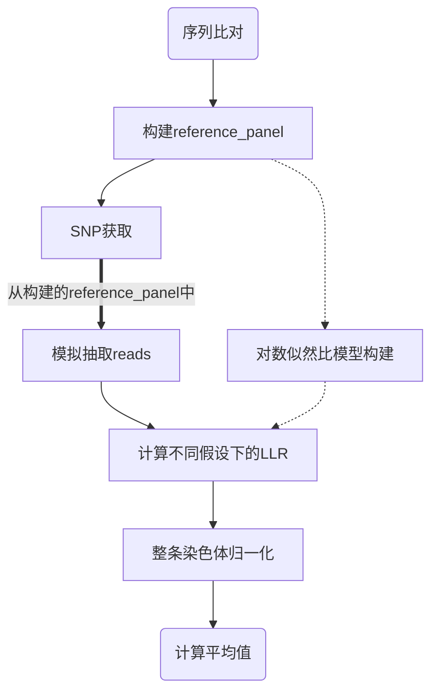
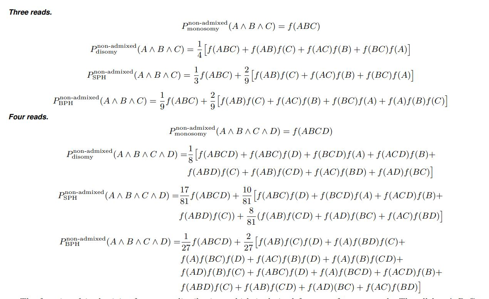

# 预测原理
[文献来源](https://www.ncbi.nlm.nih.gov/pmc/articles/PMC8609623/)

## 基础原理
<strong>从同一单倍型中提取的两个reads的几率在不同的情况下是不同的，具体来说，对于二体，几率是1 : 1; 对于单体，几率是1 : 0; 对于 BPH 三体性，几率是1 : 2; 对于 SPH 三体性，几率是5 : 4。</strong>

eg:BPH(0,1,2),SPH(1,1,2)

| 可能性 | BPH(0,1,2)             | SPH(1,1,2)             |
| ------ | ---------------------- | ---------------------- |
| 1      | <strong>(0,0)</strong> | <strong>(1,1)</strong> |
| 2      | (0,1)                  | <strong>(1,1)</strong> |
| 3      | (0,2)                  | (1,2)                  |
| 4      | (1,0)                  | <strong>(1,1)</strong> |
| 5      | <strong>(1,1)</strong> | <strong>(1,1)</strong> |
| 6      | (1,2)                  | (1,2)                  |
| 7      | (2,0)                  | (2,1)                  |
| 8      | (2,1)                  | (2,1)                  |
| 9      | <strong>(2,2)</strong> | <strong>(2,2)</strong> |

如果一对reads来自相同的同源物，观察到两个等位基因的概率由参考面板中这两个等位基因的联合频率（即它们定义的单倍型的频率）给出。相反，如果一对reads来自不同的同源物，则观察到两个等位基因的概率只是参考面板中两个等位基因频率的乘积：

计算对数似然比

当一个 read 与多个 SNP 重叠时，f ( A ) 应解释为 read A中出现的所有 SNP 等位基因的联合频率（即单倍型A的频率）。类似地，f ( AB ) 将表示出现在读数A和B中的所有 SNP 等位基因的联合频率。上面的方程被扩展为每个窗口最多考虑 18 个读数.(深度决定，除此之外，再多运算量就会成幂次增加)

## 构建snp表格
在bam文件中从给定序列中提取 SNP 位置的单碱基结果。

## 模拟抽取reads
模拟从千人基因组数据中抽取reads。模拟假设覆盖深度一致、随机交配（通过从 1000 基因组计划中随机抽取单倍型），从任何同源物中抽取reads的概率相等。重采样是在没有替换的情况下进行的，以符合统计模型关于从同一单倍型中提取两个读数的可能性的假设。迭代中，随机抽取只能是可用reads的子集。

## reads数的不同来自同源的概率不同

通过阈值划定窗口中的随机获取的reads最大值，分别计算BPH和SPH的状态下，在reads中，总体snp的等位基因频率。

## LLR计算
得到四个值，分别代表四种状态下的等位基因的频率('BPH', 'SPH', 'disomy', 'monosomy')，计算不同假设下的对数似然比，然后根据同一染色体不同窗口归一化。针对整条染色体计算平均值和标准差。